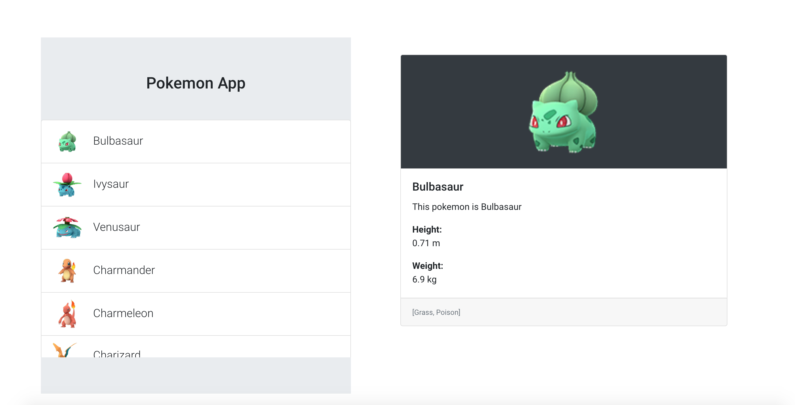

# Pokemon App Built with AngularDart

## With Firebase Integration

[Demo App](https://flutterdemo-9c586.firebaseapp.com/)

A web app that uses [AngularDart](https://webdev.dartlang.org/angular) and
[AngularDart Components](https://webdev.dartlang.org/components).

Created from templates made available by Stagehand under a BSD-style
[license](https://github.com/dart-lang/stagehand/blob/master/LICENSE).
